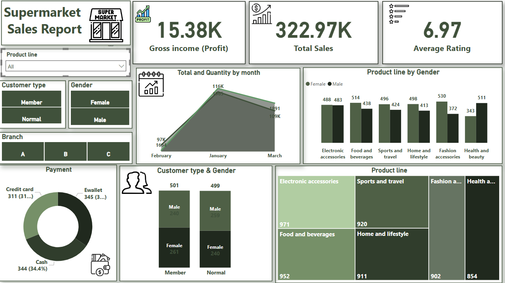

# Supermarket_Sales_powerbi
🔍designed to provide in-depth insights and support data-driven decision-making.

📌I used Power Query for data cleaning & transformation.

📌DAX Measures:

_Total Sales 

_Net Profit

_Average Rating

📌Multi-dimensional Analysis By branch, gender, customer type, product line, and payment method.

📊 Features:

_Interactive slicers for flexible filtering.

_Visual comparisons across branches and product categories.

_Dynamic KPIs and clean, intuitive layout.

